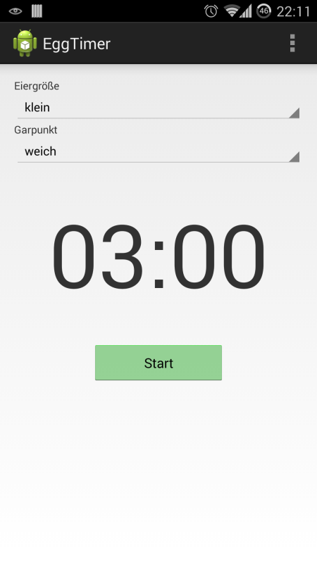
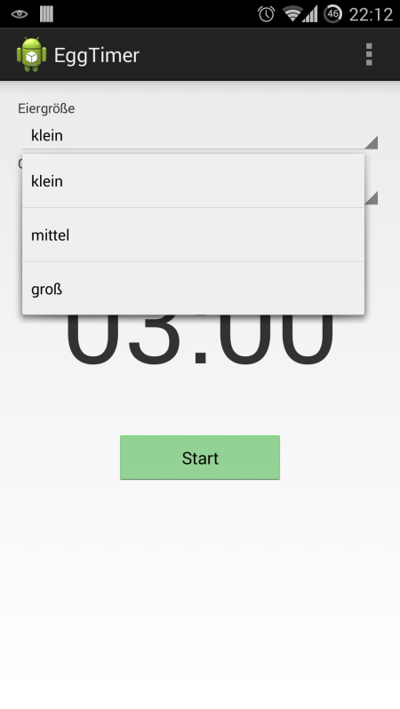
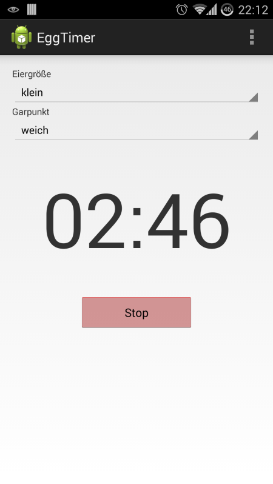

# U07 | EggTimer: Die Eieruhr


## Aufgabe

In dieser Aufgabe implementieren Sie eine Eieruhr, die das Stoppen der benötigten Zeit für verschiedene Varianten gekochter Eier erlaubt. NutzerInnen können aus drei verschiedenen Varianten (weich-, mittelhart- oder hartgekochten Eiern) wählen. Die Anwendung zählt die verbleibende Zeit herunter und informiert, sobald der Kochvorgang abschlossen ist. Durch die Verwendung eines parallelen Threads und eines *Service* verhindern wir das Blockieren des *UI Thread* und sorgen dafür, dass die Zeit auch dann weiter heruntergezählt wird, wenn die Anwendung in den Hintergrund verschoben wird.

**Diese Anwendung ist komplexer und umfangreicher als die vorherigen Übungsaufgaben. Nehmen Sie sich Zeit und lesen Sie bei Bedarf die verlinkten Informationen und schauen Sie ggf. in den Vorlesungsmaterialien und Beispielen nach. Lösen Sie die Aufgabe schrittweise. Implementieren Sie zuerst das nebenläufige Herunterzählen des Timers, bevor Sie mit der Umsetzung des Service beginnen.**

## Ausgangslage

Das *User Interface* und einige Hilfsklassen für die Repräsentation des Kochvorgangs haben wir für Sie vorbereitet. Im Starterpaket finden Sie die `EggTimerActivity`. Über das verwendete *Layout* können NutzerInnen auswählen, welche Eiervariante gekocht werden soll. Die verbleibende Zeit wird ebenfalls in dieser *Activity* angezeigt. Für die Umsetzung der Aufgabenstellung müssen Sie keine Änderungen am *User Interface* vornehmen. Wichtig für die Arbeit an der Aufgabe sind die folgenden Methoden:

- `startTimeFor(EggOrder order)`: Diese Methode wird aufgerufen, wenn NutzerInnen über Auswahlliste und *Button* einen Kochvorgang starten. Der übergebene Parameter enthält die Information, wie viele Sekunden das Ei gekocht werden muss. **Beginnen Sie hier mit der Implementierung der Timer-Logik.**

- `updateTimerValue(int remainingSeconds)`: Mit dieser Methode können Sie die Restzeit des Kochvorgangs im *User Interface* aktualisieren. Übergeben Sie die verbleibende Zeit (als Sekunden), damit diese im entsprechenden `TextView` angezeigt wird.

### Kommunikation zwischen Services und Activity

Für die spätere Kommunikation zwischen Service und Activity verwenden wir [Broadcasts](https://developer.android.com/guide/components/broadcasts#context-registered-receivers). Die notwendige Infrastruktur dafür haben wir bereits für Sie implementiert. Die `EggTimerActivity` nutzt einen *BroadcastReceiver*, der Nachrichten aus dem systemweiten *Broadcast-Netzwerk* abfängt und weitergibt. Die Activity erreichen diese Nachrichten automatisch in den Methoden `onTimerUpdate` und `onTimerFinished`. Aus Ihrem Service heraus können Sie diese Methoden über das Versenden von *Intents* erreichen. Dabei werden die Intents zuerst vom *BroadcastReceiver* abgefangen und dann über die Methoden des `EggTimerBroadcastListener`-Interface an die Activity übergeben. Die *Broadcast* werden nur empfangen, wenn die Activity aktiv, d.h. im Vordergrund ist.

**Service informiert Activity über verbleibende Zeit**

Möchten Sie die Activity aus Ihrem Service über die verbleibende Zeit des *Timers* informieren, machen Sie das mit diesem Befehl:

``` java
sendBroadcast(EggTimerBroadcastReceiver.getUpdateIntent(REMAINING_TIME));
```

Ersetzten Sie `REMAINING_TIME` durch den entsprechenden Wert in Sekunden.


**Service informiert Activity über vollständig abgelaufene Zeit**

Möchten Sie die Activity aus Ihrem Service darüber informieren, dass die Zeit im *Timer* vollständig abgelaufen ist, machen Sie das mit diesem Befehl: 

```java
sendBroadcast(EggTimerBroadcastReceiver.getEndIntent());
```

## Vorgehen

### Aktive Activity und Hintergrundprozess für Timer

Implementieren Sie ein *Runnable*, in dem die Kochzeit heruntergezählt wird und das in regelmäßigen Intervallen (z.B. jede Sekunde) die Activity über die verbleibende Zeit informiert. Nutzen Sie diese Information, um die verbleibende Zeit im *User Interface* anzuzeigen. Sorgen Sie dafür, dass das *Runnable* in einem separaten Thread ausgeführt wird. Erstellen Sie für die Verbindung zwischen Activity und *Runnable* ein geeignetes Interface, das die Methoden vorgibt, über die der Thread mit der Activity kommunizieren soll. Denken Sie daran, die Aktualisierung der verbleibenden Zeit im *UI Thread* durchzuführen (`runOnUiThread`).

**Hinweis**: Über die `Excecutors`-Klasse können Sie die Funktionen, die Sie in einem *Runnable* implementiert haben, auch wiederholt und in einem bestimmten *Intervall*, z.B. alle 5, 10 oder 20 Sekunden ausführen:

``` java
Runnable runnable = new Runnable() { // ...
ScheduledExecutorService service = Executors.newSingleThreadScheduledExecutor();
service.scheduleAtFixedRate(runnable,FIRST_DELAY,DELAY,TimeUnit.MILLISECONDS);
```

Dabei müssen Sie das *Runnable*, die Zeit bis zur ersten Ausführung und die Zeit zwischen den weiteren Ausführungen sowie die Zeiteinheit für die beiden vorherigen Werte angeben. 

`scheduleAtFixedRate` gibt ein Objekt vom Typ `ScheduledFuture` zurück, dessen Methode `cancel` Sie nutzten können, um die wiederholte Ausführung des *Runnable* zu einem beliebigen Zeitpunkt zu stoppen.

### Activity im Hintergrund und Service für Timer

Erweitern Sie Ihre Anwendung jetzt um einen [Vordergrund-Service](https://developer.android.com/guide/components/services#Foreground). Verlagern Sie das *Runnable* in den Service und lassen sie es über das erstellte *Interface* mit dem Service kommunizieren. Informieren Sie die Activity über *Broadcasts* über den aktuellen Zustand des *Timers*. Da die Activity währenddessen in den Hintergrund verschoben werden kann, müssen Sie die NutzerInnen auch aus dem *Service* heraus über das Ende des Kochvorgangs informieren. Erstellen Sie dazu eine [Notification](https://developer.android.com/training/notify-user/build-notification), die die NutzerInnen zurück zur *Activity* leitet. Spätestens wenn die NutzerInnen nach Ablauf des Timers wieder in der Activity sind, kann der Service beendet werden.

**Achtung**: Damit Ihr Service möglichst sicher vor dem automatischen Beenden durch das Android-System ist, müssen Sie ihn explizit in den Vordergrund verschieben. Führen Sie dazu die Methode [`startForeground`](https://developer.android.com/reference/android/app/Service#startForeground(int,%20android.app.Notification)) in der `onCreate`-Methode Ihres Services aus. Dabei zwingt das Android-System Sie dazu [eine Notification zu erstellen](https://developer.android.com/guide/components/services#Foreground), die NutzerInnen darüber informiert, dass Teile Ihrer Anwendung - der Service - noch aktiv sind, obwohl ggf. keine Activities mehr sichtbar sind.

#### Notification Channel

Ihre App benötigt einen *Channel*, über den die *Notifications* versendet werden. Den können Sie (auch im Service) z.B. mit dieser Methode erstellen:

``` java
private void createNotificationChannel() {
  // NOTIFICATION_CHANNEL_ID, NOTIFICATION_CHANNEL_NAME, NOTIFICATION_CHANNEL_DESCRIPTION müssen irgendwo definiert werden!
  NotificationChannel channel = new NotificationChannel(NOTIFICATION_CHANNEL_ID, NOTIFICATION_CHANNEL_NAME, NotificationManager.IMPORTANCE_DEFAULT);
  channel.setDescription(NOTIFICATION_CHANNEL_DESCRIPTION);
  NotificationManager notificationManager = getSystemService(NotificationManager.class);
  notificationManager.createNotificationChannel(channel);
 }
```

Über die vergebene ID (erster Parameter des Konstruktors), können Sie diesen Kanal dann später beim Erstellen einzelner *Notifications* verwenden.

## Screenshots der Anwendung

| | | |
|-|-|-|
|{ height=8cm } |{ height=8cm } |{ height=8cm } |