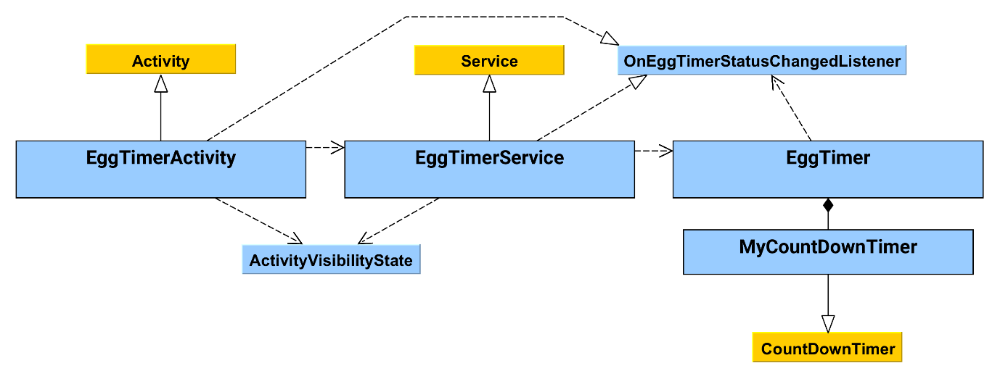
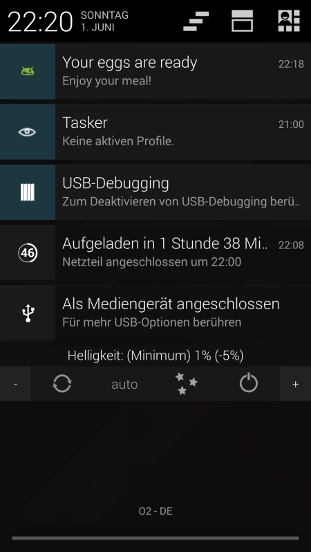
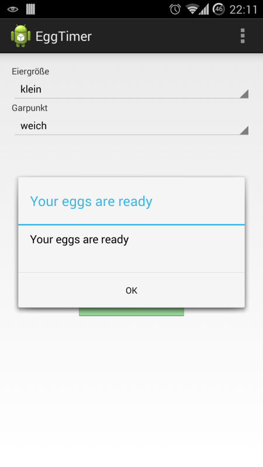
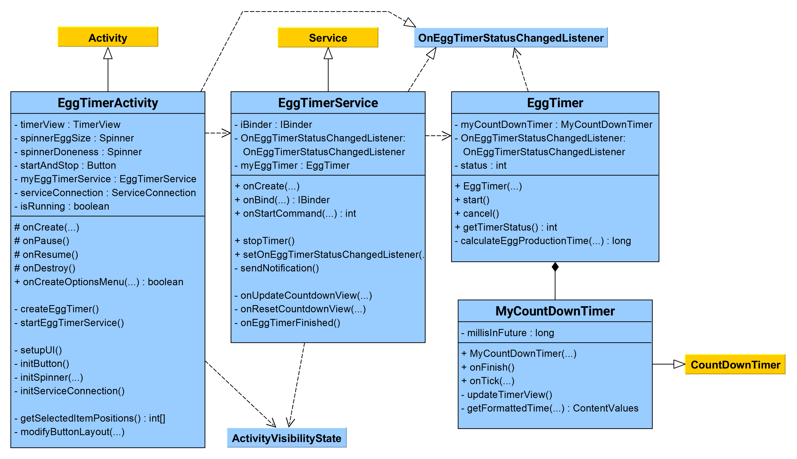

# U07 | Eieruhr


## Downloads

- [Download des Starterpakets](https://github.com/Android-Regensburg/U07-Eieruhr/archive/master.zip)
- [Download des Lösungsvorschlag](https://github.com/Android-Regensburg/U07-Eieruhr/archive/solution.zip)

## Aufgabe

In dieser Übungsaufgabe sollen Sie eine Eieruhr programmieren. Der Nutzer soll in der Lage sein, die Größe des Eis auszuwählen und anschließend noch die gewünschte Konsistenz auswählen können. Die App berechnet die optimale Kochdauer. Mit einem Klick auf Start wird die Restzeit heruntergezählt. Nach Ablauf der Kochzeit wird der Nutzer durch einen Dialog und Vibration, bzw. falls die App im Hintergrund läuft, über eine **Notification** benachrichtigt.


## Hinweise

* Vibration: Android Smartphones sind zur Vibration fähig. Hierzu bedient man sich der Klasse `Vibrator`. Der Methode vibrate ihrer Objekte wird ein Vibrationsmuster aus Zeitangaben in Millisekunden (z.B. 0 ms, 1000 ms, 1500 ms, Pause, 1000 ms) übergeben. Mehr erfahren Sie auf: https://developer.android.com/reference/android/os/Vibrator.html

* Permission: Um eine Vibration auslösen zu können, benötigt Ihre App vom System die Erlaubnis auf den Vibrationsalarm zuzugreifen. Diese müssen Sie im Manifest beantragen:
```<uses-permission android:name="android.permission.VIBRATE"/>```

* Services werden verwendet, um lang andauernde Hintergrundoperationen durchzuführen. Der Vorteil gegenüber herkömmlichen Hintergrundoperationen besteht darin, dass sie vom System einen höheren Stellenwert zugewiesen bekommen und daher bei Ressourcenknappheit eine höhere Priorität genießen.

Im folgenden Klassendiagramm können Sie den Aufbau der App sehen. Im Anhang ist noch ein Diagramm mit Detailinformationen.



## Konzept
* EggTimerActivity
  * Diese Activity implementiert das Layout und bindet alle Komponenten ein. Sie implementiert das Interface `OnEggTimerStatusChangedListener` um auf Updates im Timer zu lauschen. Das heißt in Regelmäßigen Intervallen wird die Zeitangabe aktualisiert und beim Beenden wird der User benachrichtigt.
  * Die Klasse liest die im Layout beinhalteten Spinner Elemente aus.
  * Sie erstellt ein `Eggtimer Objekt`, um eine Vorschau der Timer Dauer anzuzeigen
  * Erstellt einen Service und übergibt sich selbst als listener für die Events des `EggTimer` Objects und die Auswahl der Spinner Elemente.
  * Sie reagiert auf das aktiv und passiv schalten der App, beim passiv Schalten wird der Service unabhängig und beim aktiv Schalten wird er wieder an die Activity gebunden. Dies dient dazu das der Service mit der Activity kommunizieren kann aber weiter existiert, wenn die Activity nicht aktiv ist. Je nachdem ob der Service gebunden reagiert die Activity auf das ablaufen des Timers oder der Service.
  * Über den Button wird der Service gestartet bzw. angehalten
* EggTimer/MyCountDownTimer
  * `Eggtimer` berechnet eine Dauer. Dafür wird die Auswahl der Spinner Elemente übergeben und durch die zugewiesenen Variablen berechnet.
  * In `EggTimer` wird ein Object vom Typ `MyCountDownTimer` erstellt, diese erweitert die `CountDownTimer`. Eine Klasse, die ein Timer erstellt der in regelmäßigen Intervallen updatet.
  * `MyCountDownTimer` sendet über das Interface in jedem Intervall die aktuelle Restzeit an die Activity. Und meldet sich, wenn der Timer abgelaufen ist.
* EggTimerService
  * Erstellt ein `EggTimer` Object,dabei gibt es sich selbst als listener an weil es den `OnEggTimerStatusChangedListener` implementiert. Hier wird nun der EggTimer wirklich gestartet.
  * Der Service lauscht auf die Events des `EggTimers` und übergibt solange die Acitivity geöffnet diese weiter.
  * Würde der `EggTimer` über die Activity laufen wäre er beim minimieren der App automatisch gestoppt. Dadurch das der Service diese Aufgabe übernimmt kann der Timer unabhängig vom Zustand der App weiteraufen.
  * Der Service reagiert selbstständig auf das ablaufen des Timers wenn die Acitivity passiv ist.
* ActivityVisibilityState
  * Diese Klasse beinhaltet lediglich eine statische Variable. Die Acitivity setzt diese um den Service ihre Sichtbarkeit (passiv, aktiv) mitzuteilen.
* OnEggTimerStatusChangedListener
  * Ist ein einfaches Interfaces, über welches der `EggTimer` der Acitivity und dem Service Updates geben kann.
  
## Vorgehen
1. Laden Sie das vorgegebene Starterprojekt herunter und öffnen sie es mit Android Studio.
2. Das Layout und die Strings müssen nicht verändert werden. Sehen Sie sich aber `strings.xml` an. Es sind zwei `String-Array`-Elemente enthalten, die die beiden Spinner mit Werten beliefern.
3. Veränderungen in `EggTimer/ MyCountdownTimer`
   a) Implementieren Sie zunächst die Methode `getFormattedTime()` der inneren Klasse `MyCountdownTimer`. In dieser werden die Minuten und Sekunden der aktuell anzuzeigenden Zeit errechnet und mit der statischen Methode `valueOf(int a)` der Klasse `String` in Zeichenketten umgewandelt. Diese werden einem `ContentValues`-Objekt hinzugefügt, welches anschließend zurückgegeben wird. Beachten Sie die Tatsache, dass die Anzeige immer aus vier Ziffern bestehen soll. Überlegen Sie sich, wie Sie aus einer Zeitangabe in Millisekunden, die Minuten und Sekunden berechnen können. Rekapitulieren Sie Ihr Wissen über die Divisionsoperatoren in Java.
   b) In der Methode `updateTimerView()` holen Sie sich ein `ContentValues`-Objekt mithilfe der zuvor erstellten Methode. Aus diesem sollen nun die gespeicherten Strings entnommen und das UI mit der entsprechenden Interface-Methode aktualisiert werden.
   c) Die Methode `onTick(long millisUntilFinished)` liefert in regelmäßigen Intervallen die noch verbleibende Zeit, welche sich im Parameter `millisUntilFinished` befindet (die Methode wird vom System aufgerufen). In der Methode wird zunächst die globale Variable `status` auf `TIMERSTATUS_RUNNING` gesetzt, danach wird `millisInFuture` neu gesetzt. Zuletzt wird die Methode `updateTimerView()` aufgerufen.
   d) In der überschriebenen Methode `onFinish()` wird das UI mit einem Standardwert versehen und der `status` auf `TIMERSTATUS_STOPPED` gesetzt. Zum Abschluss wird mit der geeigneten Interface-Methode bekannt gegeben, dass die Zeit abgelaufen ist.
   e) Im Konstruktor der Klasse `MyCountDownTimer` wird zunächst der Elternkonstruktor mit den Parametern `millisInFuture` und `countdownIntervall` aufgerufen (`countdownIntervall` bestimmt, in welchem Intervall `onTick()` aufgerufen wird). Zum Schluss wird die Zeitanzeige aktualisiert.
   f) In der Methode `calculateEggProductionTime()` wird die Kochzeit berechnet. Aus den Parametern ist ersichtlich, welche Werte in den beiden Spinnern ausgewählt waren. Mit diesen Werten kann jetzt anhand der Konstanten der Klasse `EggTimer` die Kochzeit ermittelt werden. Dieses Verfahren wird auf beide `Spinner` angewandt, die Kochzeit addiert und in der Einheit Millisekunden zurückgegeben.
   g) Im `EggTimer`-Konstruktor werden die noch unbelegten Klassenvariablen belegt bzw. instanziiert.
4. Veränderungen in der `EggTimerActivity`
   a) Sehen Sie sich zunächst kurz die Methode `setupUI()` an, um sich mit den einzelnen UI-Elementen der `Activity` vertraut zu machen. Neu sind hier die `Spinner`-Elemente.
   b) Zunächst muss die Methode `getSelectedItemPositions()` implementiert werden. Hier werden mit der Methode `getSelectedItemPosition()` die aktuell ausgewählten Positionen aus den beiden Spinner-Elementen geholt und in einem `int`-Array gespeichert. Dieses Array wird anschließend zurückgegeben.
   c) In `createEggTimer()` wird mithilfe der Einträge dieses Arrays ein neues `EggTimer`-Objekt angelegt. Eine Referenz hierauf muss nicht unbedingt gehalten werden, es dient lediglich zum Aktualisieren der Zeitanzeige. Der Konstruktor der `EggTimer`-Klasse verlangt ein Objekt vom Typ `OnEggTimerStatusChangedListener` als Parameter. Deshalb muss unsere Activity das Interface implementieren und die Methoden überschreiben, damit sie bei Änderungen Bescheid bekommen kann. Die `implements`-Anweisung und die Methodenrümpfe können Sie jetzt schonmal hinzufügen.
   d) In der Methode `initButton()` wird ein `onClickListener` auf dem Button registriert. In dessen `onClick()`-Methode wird, je nachdem ob der Timer gerade läuft (Überprüfung des Felds `isRunning`) reagiert:
      i. `isRunning`: der Countdown wird abgebrochen, die Methode `modifyButtonLayout()` aufgerufen und ein neues `EggTimer`-Objekt erstellt. Das Stoppen erfolgt über die entsprechende Methode der Instanz der `EggTimerService`-Klasse.
      ii. `!isRunning`: Der Button soll entsprechend verändert, der Service soll mit der Methode `startEggTimerService()` gestartet werden, welche im Anschluss implementiert wird.
      iii. In beiden Fällen muss die Variable `isRunning` dem aktuellen Zustand angepasst werden.
   e) In `startEggTimerService()` wird ein Intent mit den aktuellen `Spinner`-Positionen erstellt und mit der Methode `startService()` gestartet.
   f) Jetzt sollen die Methoden des Interfaces `OnEggTimerStatusChangedListener` implementiert werden. In `onEggTimerFinished()` soll ein Vibrationsalarm ausgelöst werden und ein Dialog erscheinen. Die Vorgehensweise zur Erzeugung eines Dialogs ist Ihnen bereits bekannt, die Implementierung des Vibrationsmuster erfolgt durch das Anlegen eines Objekts vom Typ `Vibrator` durch die Methode `getSystemService(Context.VIBRATOR_SERVICE)` (Hinweis: Die Methode liefert ein Objekt vom Typ Object zurück, das erst noch gecastet werden muss). Das Vibrationsmuster kann frei gewählt werden. Nachdem der Dialog gezeigt worden ist, soll die Ausgangssituation wiederhergestellt werden. Die beiden übrigen Methoden des Interfaces müssen ebenfalls von Ihnen implementiert werden.
   g) Nachdem das Interface implementiert worden ist, kann die Activity in der Methode `initServiceConnection` bei der Instanz der `EggTimerService`-Klasse als `OnEggTimerStatusChangedListener` registriert werden.
   h) Da die Entscheidung, ob nach Ablauf des Countdowns ein Dialog oder eine Benachrichtigung erzeugt wird, von der Sichtbarkeit der Activity abhängt, muss diese an geeigneter Stelle festgehalten werden. Hierfür wird die Klasse `ActivityVisibilityState` verwendet, die über eine statische Variable vom Typ `boolean` (sowie entsprechender `get`- und `set`-Methoden) verfügt. Der Wert dieser Variable muss in den bereits überschriebenen Methoden `onPause` und `onResume` in  `EggTimerActivity` angepasst werden.
5. Veränderungen in `EggTimerService`
   a) In der `Service`-Klasse müssen nur zwei Methoden angepasst werden. In `stopTimer()` soll der Countdown mittels der `EggTimer`-Instanz gestoppt werden. In `onStartCommand()` soll mithilfe der `Extras` des `Intents` ein neues `EggTimer`-Objekt in der zugehörigen Klassenvariable abgelegt und anschließend gestartet werden.
   b) Das Absenden der `Notification` wird in der Interface-Methode `onEggTimerFinished()` ausgelöst. In der Methode `sendNotification()` können Sie nachsehen, wie eine `Notification` gebaut wird. In diesem Beispiel werden dieser verschiedene Eigenschaften zugewiesen, weitere bzw. andere sind durchaus denkbar.

## Quellen
Die Aufgabe basiert auf der Arbeit von Thomas Wagner und Thomas Spröd (Medieninformatik Universität Regensburg) im Sommersemester 2013

## Anhang
### Screenshots





